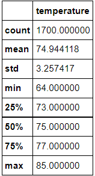
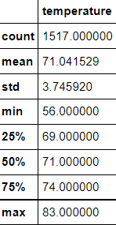

# surfs_up
## Overview of the analysis: 
  The purpose of this analysis was to utilize sqlalchemy and jupyter notebook tools to determine temperature data for the months of JUne and DEcember in the Hawaii dataset. In addition to determining the temperatures, summary statistics were computed to find the mean, median, mode, standard deviation, and interquartile ranges for the temperature data from the Hawaii dataset for the months of June and December.
## Results: 
* The average temperature for the month of June was 74.94 degrees Fahrenheit.
* The minimum temperature for the month of June was 64.0 degrees Fahrenheit.
* The maximum temperature for the month of June was 85.0 degrees Fahrenheit.
* The summary statisitics for the month of June are displayed below:

* The average temperature for the month of December was 71.04 degrees Fahrenheit.
* The minimum temperature for the month of December was 56 degrees Fahrenheit.
* The maximum temperature for the month of December was 83.0 degrees Fahrenheit.
* The summary statistics for the month of December are displayed below:

## Summary: 
  Temperatures in the dataset were relatively similar for the months of June and December. However, there was a greater standard deviation between temperature data in the December set than there was in the June set. The difference between minimum and maxiumum temperatures were greater in December than in June. One additional query that you would perform would be to gather data about precipitation in June and December. Another additional query that you could perform would be to look at the station data to see if temperatures varied across location. 
